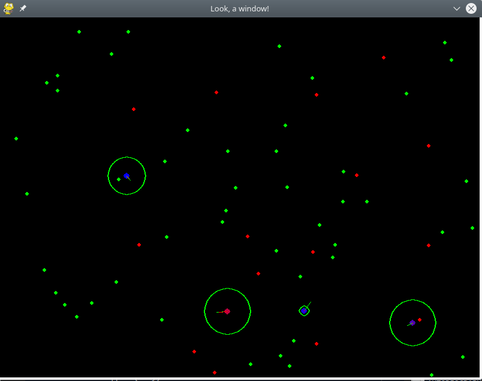

### A simple simulation of evolution using numpy and pygame.

This is a project I did to get into object oriented programming. It models a popultion of blobs that navigate a world filled with food that they must eat, and poison that they must avoid. Being alive decreases the blobs health over time. Eating food replenishes its health, and eating poison decreases the health drastically. A blob has certain attributes that will determine its success in life.

**Perception**
Indicated with a green circle, this is the radius within which the blob can see food and poison. 

**Attraction to food**
Likelyhood a blob will move towards food it has seen. Indicated with a green line in the direction of travel

**Attraction to poison**
Likelyhood a blob will move towards poison it has seen. Indicated with a red line in the direction of travel

**Mutation rate**
The attributes are given to each blob through the dna of the parent blobs. The mutation rate of a blob determines the chance a gene changes in the process of giving on the dna to the offspring

**Max rand dist**
A weirder attribute. This determines the ability of an animal to purposefully move out of an area with no food. A blob that sees no food will randomly move towards point it chooses in the distance, and the further away it can choose points, the higher the chances it can navigate away from an area without food. 

New blobs are introduced to the world in two ways. The most important way is through _sexual reproduction_ of the blobs. The fittest half of the population gets a chance to go into mating mode. This blob selects a random mate and tries to reach it. When the mating blob reaches its mate, both blobs pass on its attributes in the form of a dna string. This string encodes their attributes. The mutation rate of the blob determines how likely it is that its exact dna is passed on. The offspring dna is a random combination of the parent dna. 
The second way new blobs enter the world is throuh immigration. Blobs with a random genome spawn at the immigration rate of the simulation.

